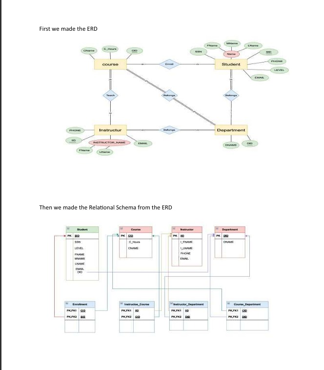
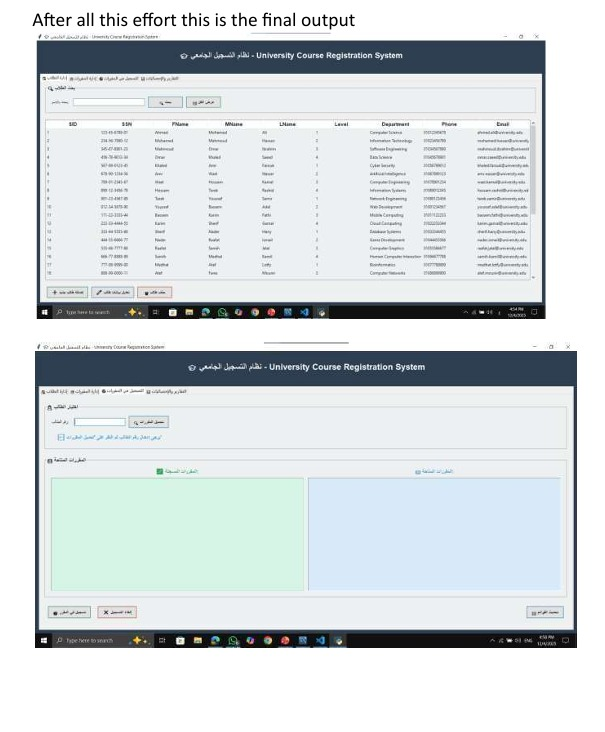
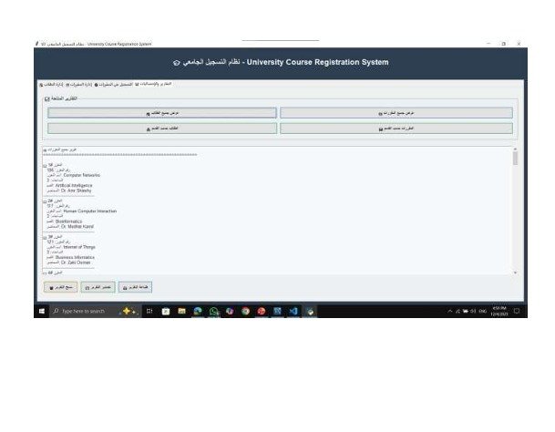

# University Course Registration System
A comprehensive management system designed to handle university course registrations. The project covers the full database lifecycle, from conceptual design using ERD and Relational Schema to implementation using SQL and a Python GUI.

## Author
Mohamed Mahmoud Abdelrazek Shaikhoun

## 🛠 My Primary Role: SQL DDL Engineering
In this team project, I took the lead on the Data Definition Language (DDL) phase. My responsibility was to build the "backbone" of the system, ensuring the database was scalable and error-proof: 
Schema Design: Translated the ERD into a physical database schema with relational tables. 
Data Integrity: Defined precise Primary Keys and Foreign Keys to manage complex relationships between Students, Courses, and Instructors. 
Advanced Constraints: Implemented CHECK constraints and Regular Expressions (REGEX) for data validation (e.g., verifying phone formats and email structures). 
System Rules: Configured ON DELETE CASCADE and SET NULL actions to maintain referential integrity during data updates. 

## 👥Team Work
This project was developed as part of a university team database project.

## 🏗 Tech Stack
Language: Python (Tkinter for GUI) 
Database: MySQL

### 📸 Screenshots
#### Entity Relationship Diagram (ERD)

#### Project User Interface (GUI)

